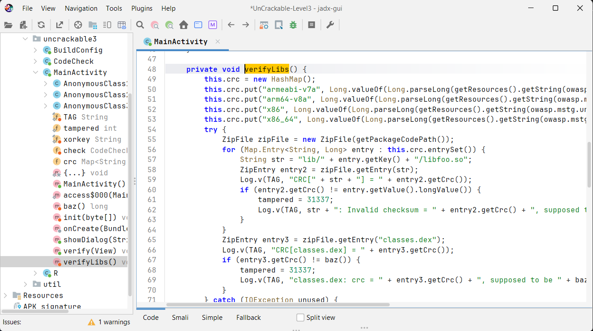
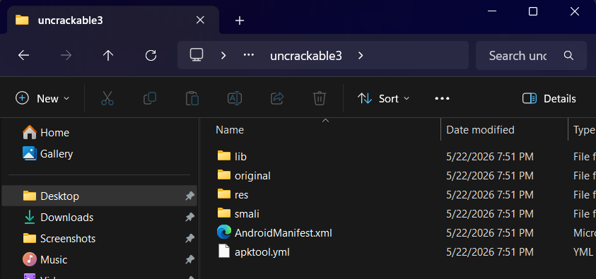
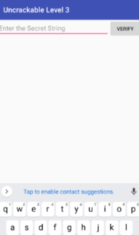
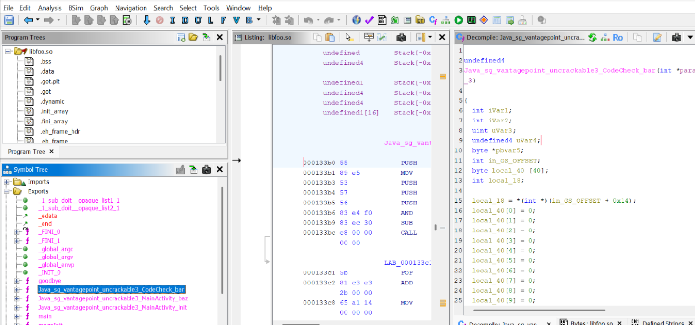

# Lab_17_MobileSecurity

# OWASP UnCrackable Android Level 3 - Writeup

## Objectif
Contourner les protections (détection de root, intégrité, anti-debug) pour récupérer et décoder la clé secrète de l'application.

## Étapes essentielles

### 1. Décompilation de l'APK
L'application doit être décompilée pour obtenir les fichiers éditables.
* **Action :** Utilisation d'Apktool pour décompiler l'APK.
* **Capture :** 
  

### 2. Patch de la détection de Root et Tampering
L'application intègre des vérifications pour bloquer l'exécution sur appareil rooté ou modifié.
* **Action :** Modification de `MainActivity.smali` pour ignorer le bloc de détection (`showDialog`) et sauter directement au démarrage normal.
* **Code Smali modifié :**
  ```smali
  :cond_0
  goto :cond_1
  ```
* **Capture :** 
  

### 3. Patch anti-debug dans la bibliothèque native
La bibliothèque `libfoo.so` bloque l'analyse dynamique et les hooks en fermant l'application.
* **Action :** Modification de la fonction native `sub_73D0` dans Ghidra en insérant une instruction `RET` dès le début pour désactiver les fonctions de détection.
* **Capture :** 
  

### 4. Analyse et décodage de la clé secrète
La validation finale est effectuée par la fonction native `check_code` de `libuncrackable3.so`.
* **Action :** Récupération des constantes de 24 octets obfusquées et écriture d'un script Python pour les déchiffrer via XOR avec la clé `pizzapizzapizzapizzapizz`.
* **Code de décodage :**
  ```python
  encoded = bytes.fromhex("1d0811130f1749150d0003195a1d1315080e5a0017081314")
  xor_key = b"pizzapizzapizzapizzapizzapizza"
  secret = bytes(a ^ b for a, b in zip(encoded, xor_key))
  print(secret.decode())
  ```
* **Capture :** 
  

## Résultat final
Le décodage XOR fournit le mot de passe secret : `making owasp great again`.

## Conclusion
Ce TP montre la synergie entre l'analyse du code Java décompilé et la rétro-ingénierie du code binaire natif sous Ghidra. Malgré l'obfuscation locale et les protections dynamiques, l'analyse statique des flux de données a permis de déduire et de contourner toutes les barrières de sécurité de l'application.
